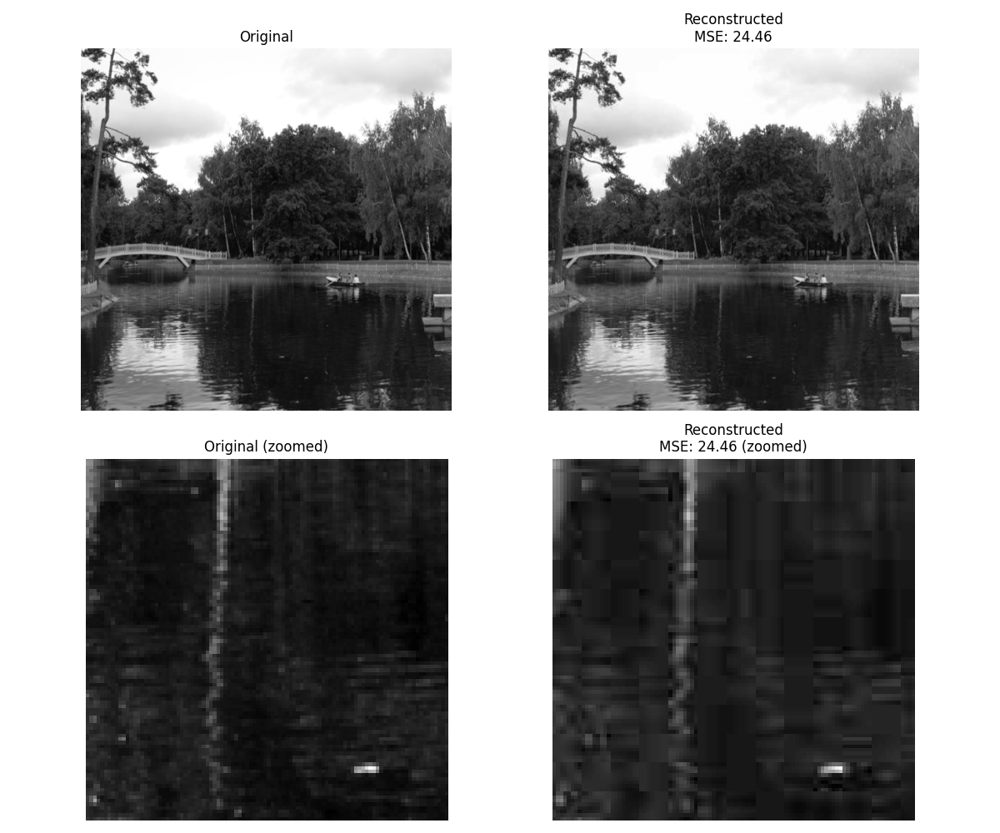
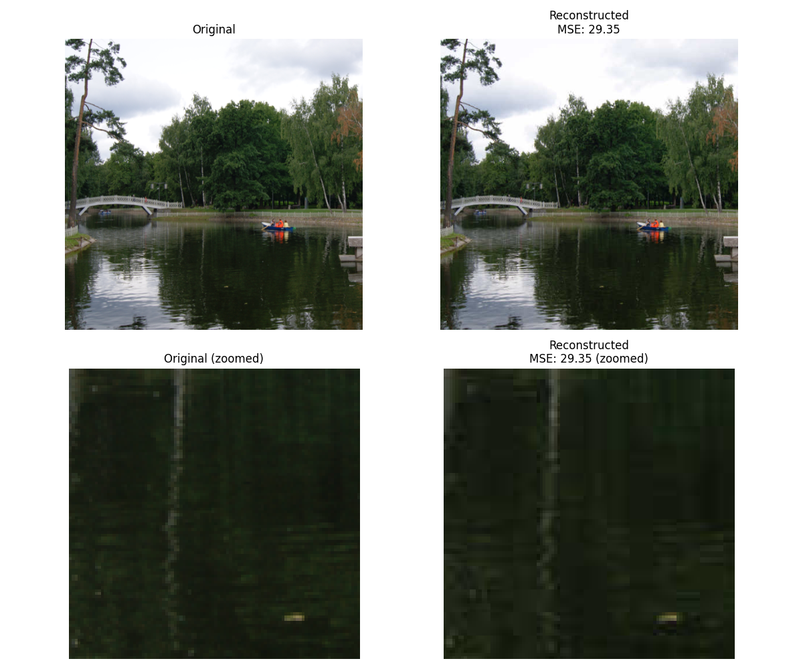
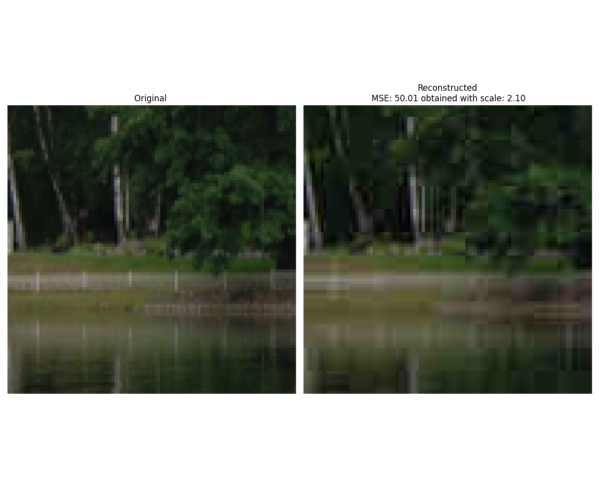
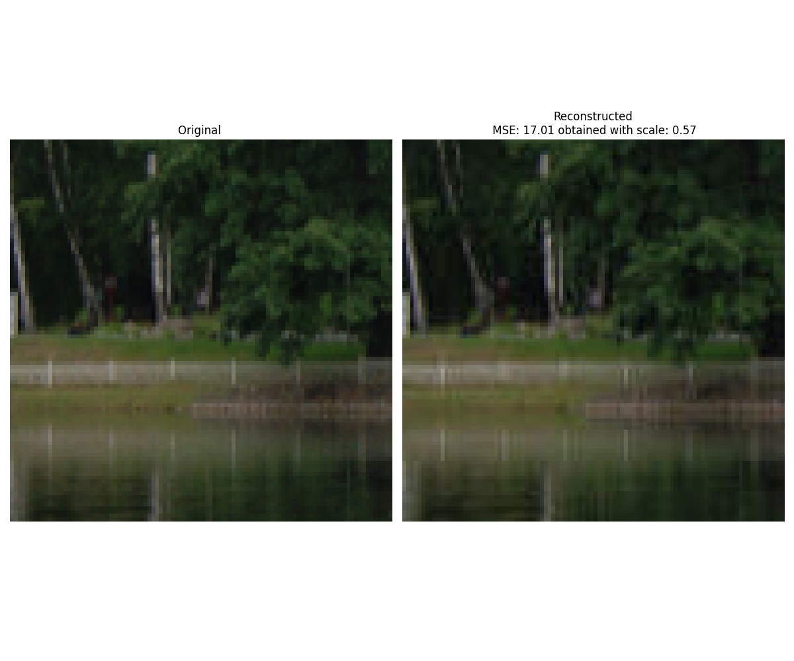

# JPEG Coder
JPEG format implementation in python.

## Encode grayscale images
Steps:

- Encoding:
    - For each block: 
        - Apply DCT to each 8x8 block
        - Divide with the quantization matrix
    - Build Huffman tree with blocks as symbols
    - Return frequency table and code

- Decoding:
    - Decode the huffman code
    - Reconstruct blocks
    - For each block:
        - Multiply with the quantization matrix
        - Apply IDCT to coefficients

Results:



Compression metrics: 
```bash
Original bits: 2048000
Compressed bits: 402732
Compression ratio: 5.085267622140779
Bits per pixel: 1.573171875
PSNR: 34.24600523967972
```
## Encode RGB images
Steps:
    - Convert an RGB image to YCrCb
    - For every channel, apply the same algorithm from above

Results:



Compression metrics: 
```bash
Original bits: 6144000
Compressed bits: 968275
Compression ratio: 6.345304794608969
Bits per pixel: 3.78232421875
PSNR: 33.45418544207216
```

## Encode image to obtain a target MSE

To get a target MSE we can scale the quantization matrix. We can do a binary search to find the number required to obtain that MSE.

Results:




## Video compression

From a given video, we extract every frame, treat every frame as an rgb image and then stack the frames to obtain a compressed image.

Input video is at `assets/mp4/video.mp4`
Output video is at `output/output.mp4`

## Python environment
```bash
python3 -m venv venv
source venv/bin/activate    
pip install --upgrade pip
pip install -r requirements.txt
```

